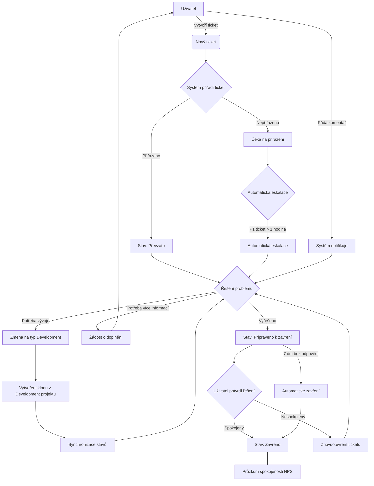

# Service Desk System User Stories

## Diagram toku

## Vytvoření ticketu

Jako uživatel chci vytvořit nový ticket, kde ve formuláři vyberu čeho se problém týká, abych mohl nahlásit problém nebo požadavek IT oddělení.

### Akceptační kritéria pro vytvoření ticketu

- [ ] Uživatel může vytvořit nový ticket přes webové rozhraní
- [ ] Formulář pro vytvoření ticketu obsahuje pole pro název, popis, prioritu a kategorii (Pohoda, HR Onboarding, IT Support, Prává, atd.)
- [ ] Formulář má pro jednotlivé kategorie povinné a nepovinné pole (např. u onboardingu je povinné pole pro jméno nového zaměstnance, datum nástupu, typ úvazku atd.)
- [ ] Systém automaticky přidělí ticketu jedinečné ID
- [ ] Po odeslání ticketu uživatel obdrží potvrzení s detaily ticketu
- [ ] Uživatel může zvolit typ ticketu, ale nesmí možnosti "Development"

## Přiřazení ticketu

Jako Řešitel chci přiřadit ticket konkrétnímu řešiteli, aby byla jasná odpovědnost za jeho vyřešení.

### Akceptační kritéria

- [ ] Řešitel může přiřadit ticket konkrétnímu členu týmu
- [ ] Systém umožňuje změnit přiřazení ticketu
- [ ] Přiřazený řešitel je notifikován e-mailem
- [ ] Historie změn přiřazení je zaznamenávána v logu ticketu
- [ ] Při převzetí ticketu se jeho stav automaticky změní na "Převzato"

## Přehled ticketů manažer

Jako manažer chci vidět přehled všech otevřených ticketů, abych mohl sledovat vytížení týmu a prioritizovat úkoly.

 ### Akceptační kritéria

- [ ] Manažer má přístup k dashboardu s přehledem všech ticketů
- [ ] Tickety lze filtrovat podle stavu, priority, přiřazeného řešitele a typu
- [ ] Dashboard zobrazuje statistiky jako počet otevřených/uzavřených ticketů a průměrnou dobu řešení

## Přehled ticketů uživatel

Jako uživatel chci vidět přehled všech otevřených ticketů, abych mohl sledovat vytížení týmu a prioritizovat úkoly.

 ### Akceptační kritéria

- [ ] vidím všechny tikety.
- [ ] Tickety lze filtrovat podle stavu, priority, přiřazeného řešitele a typu
- [ ] Běžní uživatelé vidí pouze své vlastní tickety, ne tickety ostatních uživatelů

## Přehled ticketů jako řešitel

Jako řešitel chci vidět přehled všech otevřených ticketů, abych mohl sledovat vytížení týmu a prioritizovat úkoly.

 ### Akceptační kritéria

- [ ] Tickety lze filtrovat podle stavu, priority, přiřazeného řešitele a typu
- [ ] Běžně vidím moje tikety a neřiřazené tikety.
- [ ] Tikety jsou vidět formou kanbanboard

## Notifikace o změnách stavu jako uživatel

Jako uživatel chci být notifikován o změnách stavu mého ticketu, abych byl informován o průběhu řešení.

 ### Akceptační kritéria

- [ ] Uživatel obdrží e-mailovou notifikaci při změně stavu ticketu
- [ ] Notifikace obsahuje aktuální stav ticketu a případný komentář od řešitele
- [ ] Notifikace obsahuje odkaz pro přímý přístup k detailu ticketu

## Kategorizace ticketů

Jako Řešitel chci kategorizovat tickety podle typu problému, abych usnadnil jejich třídění a analýzu.

 ### Akceptační kritéria

- [ ] Existuje předem definovaný seznam kategorií problémů
- [ ] Řešitel může přiřadit ticket do jedné kategorie
- [ ] Kategorie lze použít pro filtrování a reporting
- [ ] Uživatel může vyhledávat tickety podle kategorie

## Přidávání komentářů uživatel

Jako uživatel chci mít možnost přidat komentáře k existujícímu ticketu, abych mohl poskytnout dodatečné informace.

 ### Akceptační kritéria

- [ ] Uživatel může přidat komentář k ticketu přes webové rozhraní
- [ ] Komentáře jsou chronologicky seřazeny s časovým razítkem a jménem autora
- [ ] Systém notifikuje relevantní osoby (řešitel, zadavatel) o novém komentáři
- [ ] Komentáře lze formátovat pomocí základního Markdown syntaxu

## Interní komentáře řešitel

Jako řešitel chci mít možnost přidat interní komentáře k existujícímu ticketu, které zadavatel nevidí, ale vidí to kolegové řešitelé.

 ### Akceptační kritéria

- [ ] Uživatel může přidat komentář k ticketu přes webové rozhraní
- [ ] Komentáře jsou chronologicky seřazeny s časovým razítkem a jménem autora
- [ ] Systém notifikuje relevantní osoby (řešitel, zadavatel) o novém komentáři
- [ ] Komentáře lze formátovat pomocí základního Markdown syntaxu

## Průzkum spokojenosti

Jako Manager chci, aby uživatelé mohli vyplnit po zavření tiketu průzkum spokojenosti NPS.

### Akceptační kritéria

- [ ] Uživatel obdrží e-mail s odkazem na průzkum spokojenosti po zavření tiketu
- [ ] Průzkum spokojenosti obsahuje jednoduchou otázku "Jak byste ohodnotili naši podporu na stupnici 1-10?"
- [ ] Uživatel může zanechat komentář k hodnocení
- [ ] Výsledky průzkumu jsou zaznamenány v logu tiketu

## Eskalace ticketu

Jako Řešitel chci mít možnost eskalovat ticket na vyšší úroveň podpory, pokud problém nemohu vyřešit sám.

### Akceptační kritéria

- [ ] Řešitel může eskalovat ticket na předem definovanou vyšší úroveň podpory
- [ ] Při eskalaci je vyžadováno zdůvodnění
- [ ] Systém automaticky notifikuje příslušnou vyšší úroveň podpory
- [ ] Historie eskalací je zaznamenána v logu ticketu
- [ ] Pokud ticket s prioritou P1 není řešen do jedné hodiny, systém automaticky provede eskalaci na manažera

## Automatické uzavírání ticketů

Jako Řešitel chci, aby se tickety automaticky uzavíraly po určité době nečinnosti, abych nemusel manuálně spravovat neaktivní tickety.

 ### Akceptační kritéria

- [ ] Pokud uživatel neodpoví na ticket do 7 dní, systém automaticky změní stav ticketu na "Připraveno k zavření"
- [ ] Pokud ticket zůstane ve stavu "Připraveno k zavření" dalších 7 dní, systém automaticky změní jeho stav na "Zavřeno"
- [ ] Uzavřené tickety nelze komentovat ani měnit jejich stav
- [ ] Systém zaznamenává všechny automatické změny stavu do logu ticketu

## Generování reportů

Jako manažer chci generovat reporty o výkonnosti Service Desku, abych mohl analyzovat efektivitu týmu a identifikovat oblasti pro zlepšení.

 ### Akceptační kritéria

- [ ] Manažer má přístup k rozhraní pro generování předem definovaných reportů
- [ ] Reporty zahrnují metriky jako průměrná doba řešení, počet vyřešených ticketů, spokojenost zákazníků
- [ ] Reporty lze generovat za zvolené časové období

## Integrace s Development projektem

Jako Řešitel chci, aby tickety typu "Development" byly automaticky zařazeny do vývojového procesu a synchronizovány mezi Service Desk a Development projektem.

 ### Akceptační kritéria

- [ ] Při vytvoření ticketu typu "Development" nebo změně typu na "Development" se ticket automaticky nastaví na stav "Zařazeno na vývoj"
- [ ] Systém automaticky vytvoří klon ticketu v projektu Development
- [ ] Mezi ticketem v Service Desk a jeho klonem v Development projektu se vytvoří obousměrná vazba
- [ ] Stavy ticketů se synchronizují mezi oběma projekty:
  - [ ] "In Progress" v Development odpovídá "In Progress" v Service Desk
  - [ ] "Done" v Development odpovídá "Ready to Closure" v Service Desk
- [ ] Změny v jednom projektu se automaticky projeví v druhém projektu
- [ ] Historie synchronizace a vazeb je zaznamenána v logu ticketu
